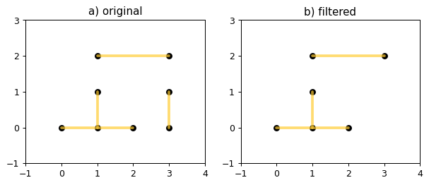
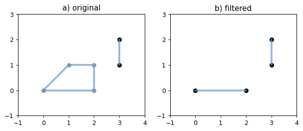
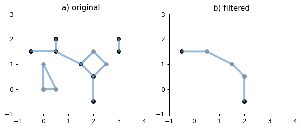

# Shapely_line_filter - an illustration

---
This tool simplifies a network consists of polylines, for example, a river network.

__The tool does two things:__
1. Remove short disconnected lines.
2. For lines share the same endpoints, remove those which are not the shortest. 
---

The tool requires the [Shapely](https://github.com/Toblerity/Shapely) Python package.

## 1. Remove short disconnected lines
Let's first create a [MultiLineString](https://shapely.readthedocs.io/en/latest/manual.html#MultiLineString) that needs to be simplified.


```python
from shapely.geometry import MultiLineString
from pprint import pprint


# original
coords1 = [((0, 0), (2, 0)), ((1, 0), (1, 1)), ((1, 2), (3, 2)), ((3, 0), (3, 1))]
mline1 = MultiLineString(coords1)
pprint(list(mline1))
```

    [<shapely.geometry.linestring.LineString object at 0x00000294DAC62C88>,
     <shapely.geometry.linestring.LineString object at 0x00000294DAC62D48>,
     <shapely.geometry.linestring.LineString object at 0x00000294DAC62D88>,
     <shapely.geometry.linestring.LineString object at 0x00000294DAC62DC8>]
    

Our *MultiLineString* consists of four *LineStrings*. If your goal is to filter out the short disconnected line `((3, 0), (3, 1))`, which has a `length` of 1, you can use `remove_disconnected()` method from the class `LineFilter` within the *shapey_line_filter.py* module to achieve that. 


```python
# put shapely_line_filter.py in this Jupyter Notebook project directory, here: 'C:\Jupyter', 
# then import python files from this directory
import sys  
sys.path.insert(0, 'C:\Jupyter')

from shapely_line_filter import LineFilter 
```


```python
my_mline1 = LineFilter(mline1)
```

The `remove_disconnected()` method will detect disconnected lines first --- those do not [intersect](https://shapely.readthedocs.io/en/latest/manual.html#object.intersects) others. Then we will specify that any lines that have a length less than 2 are short lines. These short disconnected lines will be removed. The length should be adjusted based on the data or map you are working with, and use a projected map to work in meaningful units like meters.


```python
# filtered
mline1_filtered = my_mline1.remove_disconnected(length=2)
```


```python
# the filtered one is also a MultiLineString
print(type(mline1_filtered))
```

    <class 'shapely.geometry.multilinestring.MultiLineString'>
    


```python
# simple illustrations of a original and the filtered MultiLineString
%matplotlib inline
from matplotlib import pyplot
from figures import SIZE, set_limits, plot_line, plot_bounds, color_issimple
from figures import plot_coords as _plot_coords


def plot_coords(ax, ob):
    for line in ob:
        _plot_coords(ax, line, zorder=1)


def plot_lines(ax, ob):
    color = color_issimple(ob)
    for line in ob:
        plot_line(ax, line, color=color, alpha=0.7, zorder=2)


fig = pyplot.figure(1, figsize=SIZE, dpi=90)

# original
ax = fig.add_subplot(121)

plot_coords(ax, mline1)
plot_bounds(ax, mline1)
plot_lines(ax, mline1)

ax.set_title('a) original')
set_limits(ax, -1, 4, -1, 3)

# filtered
ax = fig.add_subplot(122)

plot_coords(ax, mline1_filtered)
plot_bounds(ax, mline1_filtered)
plot_lines(ax, mline1_filtered)

ax.set_title('b) filtered')
set_limits(ax, -1, 4, -1, 3)

pyplot.show()
```


    

    


Note: the figures module simpily modifies the size of the Matplotlib figure, if you really need this module, it locates here: https://github.com/Toblerity/Shapely/blob/master/docs/code/figures.py, and you may put it in your project directory as well, here: 'C:\Jupyter'.

## 2. For lines share the same endpoints, remove those which are not the shortest
This tool can also simplify a network by removing some loops. For example, oxbow lakes formed at the meanders of a river.


```python
# original
mline2 = MultiLineString([((0, 0), (2, 0)), ((0, 0), (1, 1), (2, 1), (2, 0)), ((3, 1), (3, 2))])
```

The `remove_oxbow()` method will detect lines share the same endpoints first, then remove all the longer lines and remain the shortest. For example, line `((0, 0), (2, 0))` and line `((0, 0), (1, 1), (2, 1), (2, 0))` both share the same endpoints `(0, 0)` and `(2, 0)`. The first line has a length of 2, while the second line (seems like an oxbow lake) has a length of 3.4, so the second line, which is longer, will be removed if using `remove_oxbow()` method. This method is inside the class `LineFilter`, which we have already imported. 


```python
my_mline2 = LineFilter(mline2)
# filtered
mline2_filtered = my_mline2.remove_oxbow()  # a MultiLineString 
```


```python
# simple illustrations of a original and the filtered MultiLineString
fig = pyplot.figure(1, figsize=SIZE, dpi=90)

# original
ax = fig.add_subplot(121)

plot_coords(ax, mline2)
plot_bounds(ax, mline2)
plot_lines(ax, mline2)

ax.set_title('a) original')
set_limits(ax, -1, 4, -1, 3)

# filtered
ax = fig.add_subplot(122)

plot_coords(ax, mline2_filtered)
plot_bounds(ax, mline2_filtered)
plot_lines(ax, mline2_filtered)

ax.set_title('b) filtered')
set_limits(ax, -1, 4, -1, 3)

pyplot.show()
```


    

    


## 3. Filtering using both methods (an application)
If you want to apply both filters to your network, we do have a method `remove_disconnected_and_oxbow()` in class `LineFilter` that will do the job.


```python
import fiona
import time
from shapely.geometry import shape, mapping, MultiLineString
from shapely.ops import unary_union, linemerge
from shapely_line_filter import LineFilter
```

The source data could be either a ESRI Shapefile or a GeoJSON file, here we use the projected GEOJSON file consists of rivers and streams (line element) in Liechtenstein obtained from OpenStreetMap as an example. Put the source file *liechtenstein_river_stream_proj.geojson* into your working directory, here: 'C:\Jupyter'. You should put the *shapely_line_filter.py* in your wokring directory too.


```python
# read the source file with fiona and get the source driver, crs, and schema
with fiona.open("liechtenstein_river_stream_proj.geojson") as source:
    source_driver = source.driver
    source_crs = source.crs
    source_schema = source.schema

    mline = [shape(feature['geometry']) for feature in source]  # returns a new, independent line geometry with coordinates
    mline_merge = linemerge(mline)  # merge lines, return a MultiLineString representing the merger of all contiguous elements of lines.
    mline_split = unary_union(mline_merge)  # split lines at all intersections, return a MultiLineString

    start_time = time.time()  # start recording the processing time
    # using shapely_line_filter
    my_mline = LineFilter(mline_split)
    # remove both short disconnected lines (no longer than 4 km) and oxbow lakes
    mline_filtered = my_mline.remove_disconnected_and_oxbow(length=4000)  # default length=4000, in meter
    print(f"Filtering lines lasted {round(time.time() - start_time, 0)} "
          f"seconds.")
    print(f"Number of lines before filtering: {len(mline_split)}")
    print(f"Number of lines after filtering: {len(mline_filtered)}")
```

    Filtering lines lasted 11.0 seconds.
    Number of lines before filtering: 402
    Number of lines after filtering: 368
    


```python
# plots (parts) of the original and the filtered network
fig = pyplot.figure(1, figsize=(10, 6), dpi=90)

# original
ax = fig.add_subplot(121)

plot_lines(ax, mline_split)

ax.set_title('a) original')
ax.set_xlim(538600, 539800)
ax.set_xticks(range(538600, 539800+1, 300))
ax.set_ylim(5220600, 5221600)
ax.set_yticks(range(5220600, 5221600+1, 200))
ax.set_aspect("equal")

# filtered
ax = fig.add_subplot(122)

plot_lines(ax, mline_filtered)

ax.set_title('b) filtered')
ax.set_xlim(538600, 539800)
ax.set_xticks(range(538600, 539800+1, 300))
ax.set_ylim(5220600, 5221600)
ax.set_yticks(range(5220600, 5221600+1, 200))
ax.set_aspect("equal")

pyplot.show()
```


    

    


Note that the two short disconnected lines and the oxbow lake in the middle were removed.


```python
# write shapely geometries to shapefiles in your working directory
with fiona.open('200928_river4ogs_Liechtenstein_river_stream_v3.shp', 'w',
                driver='ESRI Shapefile',
                crs=source_crs,
                schema=source_schema) as c:
    for line in mline_filtered:
        c.write(dict(geometry=mapping(line),
                     properties=source_schema['properties']))
```
