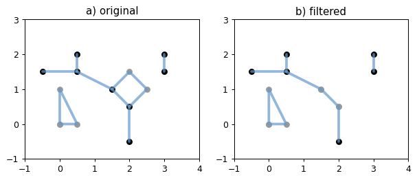

# Shapely_line_filter - an illustration

---
This tool filters a network consists of polylines, for example, a river network. Input and output are all [MultiLineString](https://shapely.readthedocs.io/en/latest/manual.html#MultiLineString). Source data like ESRI Shapefile and GeoJSON file can be filtered or simplified using this tool, however, the attribute table of the original data will not exist in your filtered data.

__The tool does four things:__
1. Remove short dead-end lines.
2. Remove short disjoint lines.
3. Remove rings.
4. Remove oxbow lakes.
---

The tool requires the [Shapely](https://github.com/Toblerity/Shapely) Python package.

## 1. Remove short dead-end lines
Dead-end lines intersect only one other line.
First, create a simple *MultiLineString* that needs to be filtered.


```python
from shapely.geometry import MultiLineString
from pprint import pprint


# Original
multi_line = MultiLineString(
    [((-0.5, 1.5), (0.5, 1.5)), ((0.5, 1.5), (0.5, 2)), ((0.5, 1.5), (1.5, 1)), ((1.5, 1), (2, 0.5)), ((3, 1.5), (3, 2)),
     ((1.5, 1), (2, 1.5), (2.5, 1), (2, 0.5)), ((2, 0.5), (2, -0.5)), ((0, 0), (0, 1), (0.5, 0), (0, 0))])
pprint(list(multi_line))
```

    [<shapely.geometry.linestring.LineString object at 0x00000250DC0DB348>,
     <shapely.geometry.linestring.LineString object at 0x00000250DBB5A588>,
     <shapely.geometry.linestring.LineString object at 0x00000250DC0DB308>,
     <shapely.geometry.linestring.LineString object at 0x00000250DC0DB3C8>,
     <shapely.geometry.linestring.LineString object at 0x00000250DC0DB408>,
     <shapely.geometry.linestring.LineString object at 0x00000250DC0DB448>,
     <shapely.geometry.linestring.LineString object at 0x00000250DC0DB488>,
     <shapely.geometry.linestring.LineString object at 0x00000250DC0DB4C8>]
    

Put *shapely_line_filter.py* in the project directory, here: 'C:\Jupyter', then import python files from this directory. We need to insert the project file path too.


```python
import sys  
sys.path.insert(0, 'C:\Jupyter')

from shapely_line_filter import LineFilter 
```

The original *MultiLineString* consists of 8 *LineStrings*. Two lines are dead-end lines: line `((-0.5, 1.5), (0.5, 1.5))` and line `((0.5, 1.5), (0.5, 2))`, which has a length of 1 and 0.5, separately. Use `remove_dead_end()` method to filter out the short dead-end line `((0.5, 1.5), (0.5, 2))`. The `remove_dead_end()` method can be found in the class `LineFilter` within the *shapey_line_filter.py* module. The method returns a MultiLineString too. We first use `update_length()` method to define a `length`, lines shorter than this will be filtered out. The `update_length()` method defines `length` for `remove_dead_end()`, `remove_disjoint()`, and `simplify_line()` methods. The length should be adjusted based on the data or map you are working with, and use a projected map to work in meaningful units like meters.


```python
my_multi_line = LineFilter(multi_line)
my_multi_line.update_length(1)
# Filtered
multi_line_filtered1 = my_multi_line.remove_dead_end()
print(type(multi_line_filtered1))
```

    <class 'shapely.geometry.multilinestring.MultiLineString'>
    


```python
# Plot the original and the filtered network
%matplotlib inline
from matplotlib import pyplot
from figures import SIZE, set_limits, plot_line, plot_bounds, color_issimple
from figures import plot_coords as _plot_coords


def plot_coords(ax, ob):
    for line in ob:
        _plot_coords(ax, line, zorder=1)


def plot_lines(ax, ob):
    color = color_issimple(ob)
    for line in ob:
        plot_line(ax, line, color=color, alpha=0.7, zorder=2)


fig = pyplot.figure(1, figsize=SIZE, dpi=90)

# Original
ax = fig.add_subplot(121)

plot_coords(ax, multi_line)
plot_bounds(ax, multi_line)
plot_lines(ax, multi_line)

ax.set_title('a) original')
set_limits(ax, -1, 4, -1, 3)

# Filtered
ax = fig.add_subplot(122)

plot_coords(ax, multi_line_filtered1)
plot_bounds(ax, multi_line_filtered1)
plot_lines(ax, multi_line_filtered1)

ax.set_title('b) filtered')
set_limits(ax, -1, 4, -1, 3)

pyplot.show()
```


    

    


__Note__: the figures module simpily modifies the size of the Matplotlib figure, if you really need this module, it locates here: https://github.com/Toblerity/Shapely/blob/master/docs/code/figures.py, and you may put it in your project directory as well, here: 'C:\Jupyter'.

## 2. Remove short disjoint lines
[Disjoint](https://shapely.readthedocs.io/en/latest/manual.html#object.disjoint) lines are lines that their boundary and interior do not intersect at all with those of the other.


```python
my_multi_line = LineFilter(multi_line)
my_multi_line.update_length(1) # disjoint lines shorter than 1 will be filtered out
# Filtered
multi_line_filtered2 = my_multi_line.remove_disjoint()
```


```python
# Plot the original and the filtered network
fig = pyplot.figure(1, figsize=SIZE, dpi=90)

# Original
ax = fig.add_subplot(121)

plot_coords(ax, multi_line)
plot_bounds(ax, multi_line)
plot_lines(ax, multi_line)

ax.set_title('a) original')
set_limits(ax, -1, 4, -1, 3)

# Filtered
ax = fig.add_subplot(122)

plot_coords(ax, multi_line_filtered2)
plot_bounds(ax, multi_line_filtered2)
plot_lines(ax, multi_line_filtered2)

ax.set_title('b) filtered')
set_limits(ax, -1, 4, -1, 3)

pyplot.show()
```


    

    


## 3. Remove rings
Self-contained rings share the same endpoint. Note that disjoint rings are also disjoint lines, thus will be removed already when using `remove_disjoint()` method, if their length are shorter than the given `length`.


```python
my_multi_line = LineFilter(multi_line)
# Filtered
multi_line_filtered3 = my_multi_line.remove_ring()
```


```python
# Plot the original and the filtered network
fig = pyplot.figure(1, figsize=SIZE, dpi=90)

# Original
ax = fig.add_subplot(121)

plot_coords(ax, multi_line)
plot_bounds(ax, multi_line)
plot_lines(ax, multi_line)

ax.set_title('a) original')
set_limits(ax, -1, 4, -1, 3)

# Filtered
ax = fig.add_subplot(122)

plot_coords(ax, multi_line_filtered3)
plot_bounds(ax, multi_line_filtered3)
plot_lines(ax, multi_line_filtered3)

ax.set_title('b) filtered')
set_limits(ax, -1, 4, -1, 3)

pyplot.show()
```


    

    


## 4. Remove oxbow lakes
Oxbow lake is U-shaped bend from a river or stream, which is cut off from the main stream and still connected to the main stream at its both ends. All lines that share the same ends (start- and end point) will be compared with each other once, filter out longer lines and then return the shortest line. Oxbow lakes that connected at only one end or disconnected to the main stream are defined as dead-end and disjoint lines, separately.


```python
my_multi_line = LineFilter(multi_line)
# Filtered
multi_line_filtered4 = my_multi_line.remove_oxbow()
```


```python
# Plot the original and the filtered network
fig = pyplot.figure(1, figsize=SIZE, dpi=90)

# Original
ax = fig.add_subplot(121)

plot_coords(ax, multi_line)
plot_bounds(ax, multi_line)
plot_lines(ax, multi_line)

ax.set_title('a) original')
set_limits(ax, -1, 4, -1, 3)

# Filtered
ax = fig.add_subplot(122)

plot_coords(ax, multi_line_filtered4)
plot_bounds(ax, multi_line_filtered4)
plot_lines(ax, multi_line_filtered4)

ax.set_title('b) filtered')
set_limits(ax, -1, 4, -1, 3)

pyplot.show()
```


    

    


## 5. Filtering using all methods
By default, the `simplify_line()` method will execute the above mentioned methods in this order: `remove_dead_end()`, `remove_disjoint()`, `remove_ring()`, and `remove_oxbow()`. `remove_ring()` or `remove_oxbow()` will not be executed if `remove_ring=False` or `remove_oxbow=False`. By default, they are `True`.


```python
my_multi_line = LineFilter(multi_line)
my_multi_line.update_length(1)
# Filtered
multi_line_filtered = my_multi_line.simplify_line(remove_ring=True, remove_oxbow=True)
```


```python
# Plot the original and the filtered network
fig = pyplot.figure(1, figsize=SIZE, dpi=90)

# Original
ax = fig.add_subplot(121)

plot_coords(ax, multi_line)
plot_bounds(ax, multi_line)
plot_lines(ax, multi_line)

ax.set_title('a) original')
set_limits(ax, -1, 4, -1, 3)

# Filtered
ax = fig.add_subplot(122)

plot_coords(ax, multi_line_filtered)
plot_bounds(ax, multi_line_filtered)
plot_lines(ax, multi_line_filtered)

ax.set_title('b) filtered')
set_limits(ax, -1, 4, -1, 3)

pyplot.show()
```


    

    


## 6. An application
Liechtenstein river and stream network (see folder Liechtenstein) is used here as an example to see how the tool works. The source data could be either a ESRI Shapefile or a GeoJSON file. The projected GeoJSON file consists of rivers and streams (line element) in Liechtenstein obtained from OpenStreetMap. Put the source file *liechtenstein_river_stream_proj.geojson* into your working directory, here: 'C:\Jupyter'. You should put the *shapely_line_filter.py* in your wokring directory too.


```python
import fiona
import time
from shapely.geometry import shape, mapping, MultiLineString
from shapely.ops import unary_union, linemerge
from shapely_line_filter import LineFilter
```


```python
# Read the source file with fiona and get the source driver, crs, and schema
with fiona.open("liechtenstein_river_stream_proj.geojson") as source:
    source_driver = source.driver
    source_crs = source.crs
    source_schema = source.schema

    multi_line = [shape(feature['geometry']) for feature in source]  # returns a new, independent line geometry with coordinates
    multi_line_union = unary_union(multi_line)  # union LineStrings and MultiLineStrings into a MultiLineString (which also split lines at their intersections)
    multi_line_merge = linemerge(multi_line_union)  # merge all contiguous lines, return a MultiLineString

    start_time = time.time()  # start recording the processing time
    # Using shapely_line_filter
    my_multi_line = LineFilter(multi_line_merge)
    # Define short (dead-end and disjoint) lines are those not longer than 1 km
    my_multi_line.update_length(1000)
    multi_line_filtered = my_multi_line.simplify_line()
    print(f"Filtering lines lasted {round(time.time() - start_time, 0)} "
          f"seconds.")
    print(f"Number of lines before filtering: {len(multi_line_merge)}")
    print(f"Number of lines after filtering: {len(multi_line_filtered)}")
```

    Filtering lines lasted 3.0 seconds.
    Number of lines before filtering: 402
    Number of lines after filtering: 62
    


```python
# Plot the original and the filtered network
from math import sqrt

def plot_lines(ax, ob):
    color = color_issimple(ob)
    for line in ob:
        plot_line(ax, line, color=color, linewidth=1, alpha=0.7, zorder=2)

GM = (sqrt(5)-1.0)/2.0
W = 8.0
H = W/GM
SIZE = (W, H)

fig = pyplot.figure(1, figsize=(SIZE), dpi=90)

# Original
ax = fig.add_subplot(121)
plot_lines(ax, multi_line_merge)
ax.set_title('a) original')
ax.set_xlim(533200, 549200)
ax.set_xticks(range(533200, 549200+1, 4000))
ax.set_ylim(5207200, 5231200)
ax.set_yticks(range(5207200, 5231200+1, 4000))
ax.set_aspect("equal")

# Filtered
ax = fig.add_subplot(122)
plot_lines(ax, multi_line_filtered)
ax.set_title('b) filtered')
ax.set_xlim(533200, 549200)
ax.set_xticks(range(533200, 549200+1, 4000))
ax.set_ylim(5207200, 5231200)
ax.set_yticks(range(5207200, 5231200+1, 4000))
ax.set_aspect("equal")

pyplot.show()
```


    

    


```python
# Write shapely geometries to shapefiles in your working directory
with fiona.open('201028_river4ogs_Liechtenstein_river_stream_v1.shp', 'w',
                driver='ESRI Shapefile',
                crs=source_crs,
                schema=source_schema) as c:
    for line in multi_line_filtered:
        c.write(dict(geometry=mapping(line),
                     properties=source_schema['properties']))
```
